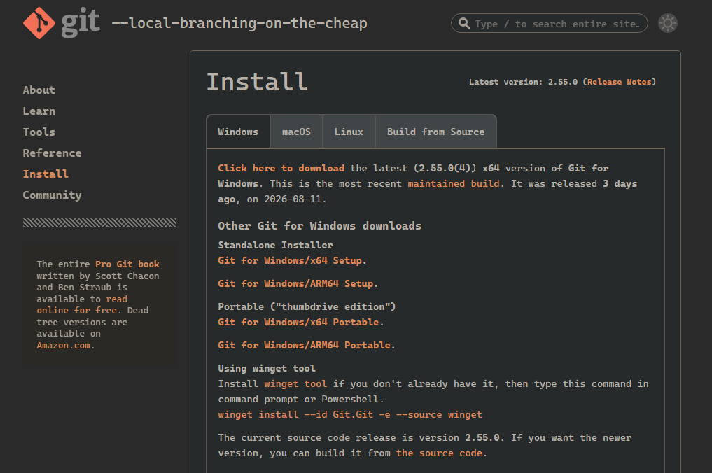

# Git e GitHub

Git e GitHub são duas ferramentas de programação; a diferença é que elas funcionam de formas diferentes, mas ainda assim de maneira interligada.

## Git

### O que é o Git?

Git é uma ferramenta de controle de versão, ou seja, ela ajuda a visualizar modificações no código de forma que você possa ver apenas as alterações individuais.

Dessa forma, o código fica muito mais organizado do que trocando arquivos ou copiando e colando trechos de alguém.

Ele salva as suas mudanças como "commits", você pode enviar seu projeto Git no GitHub caso queira.


### Como instalar?

#### Windows



1. Acesse o site oficial do Git em [git-scm.com](https://git-scm.com/download/win).
2. Baixe o instalador apropriado para a sua arquitetura (32-bit ou 64-bit).
3. Execute o instalador (`.exe`) baixado e avance pelas etapas do assistente (as opções padrão funcionam bem para a maioria dos usuários).
4. Para confirmar a instalação, abra o Prompt de Comando (CMD) ou PowerShell e digite:
   ```cmd
   git --version
   ```

#### Linux

No Linux, você pode instalar o Git usando o gerenciador de pacotes da sua distribuição:

- **Debian / Ubuntu e derivados:**
  ```bash
  sudo apt update
  sudo apt install git
  ```
- **Fedora / RHEL:**
  ```bash
  sudo dnf install git
  ```
- **Arch Linux / Manjaro:**
  ```bash
  sudo pacman -S git
  ```

Para verificar se a instalação deu certo, abra o terminal e digite:
```bash
git --version
```

#### macOS

Você pode instalar o Git no macOS de algumas formas:

1. **Via Homebrew (Recomendado):**
   Se você usa o Homebrew, basta rodar no terminal:
   ```bash
   brew install git
   ```
2. **Via Xcode Command Line Tools:**
   Execute o comando abaixo no terminal para instalar as ferramentas de linha de comando:
   ```bash
   xcode-select --install
   ```
3. **Pelo instalador oficial:**
   Acesse [git-scm.com/download/mac](https://git-scm.com/download/mac) e baixe o instalador.

Para verificar se foi instalado corretamente:
```bash
git --version
```

#### OpenBSD

No OpenBSD, você pode instalar o Git utilizando o gerenciador de pacotes `pkg_add`:

```sh
doas pkg_add git
```
*(ou executando `pkg_add git` como usuário root)*

Para verificar a instalação:
```sh
git --version
```

## GitHub

### O que é o GitHub?


GitHub é uma plataforma feita pra você hospedar seus projetos feitos com Git, tipo como o YouTube te deixa enviar videos, você pode enviar repositórios Git pro GitHub.


### Como usar?

Pra usar o GitHub basta você acessar o site e criar uma conta.

### Como enviar um repositório git do meu computador para o GitHub?

#### Caso você não tenha ainda inicializado / instalado o git no seu projeto

TBA.

#### Caso você já tenha ainda inicializado / instalado o git no seu projeto

TBA.
